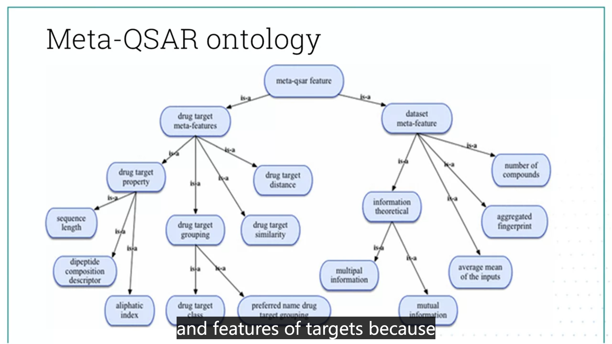
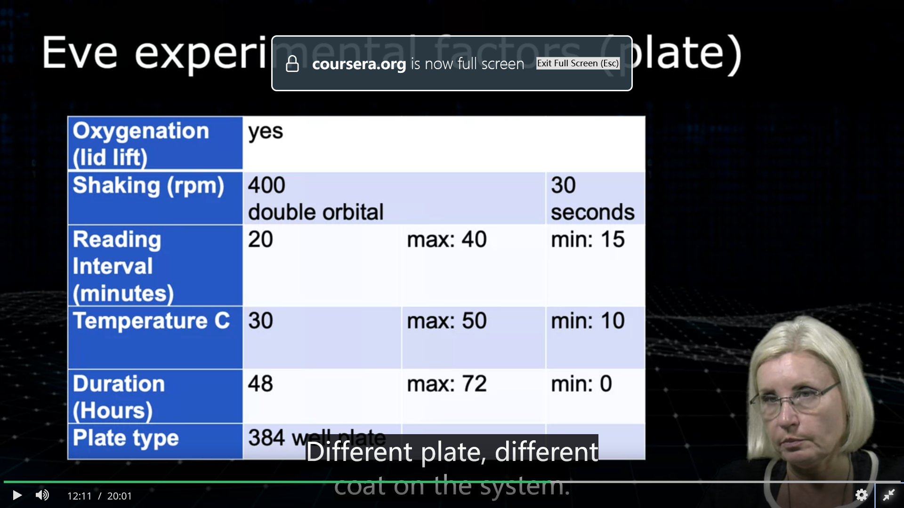
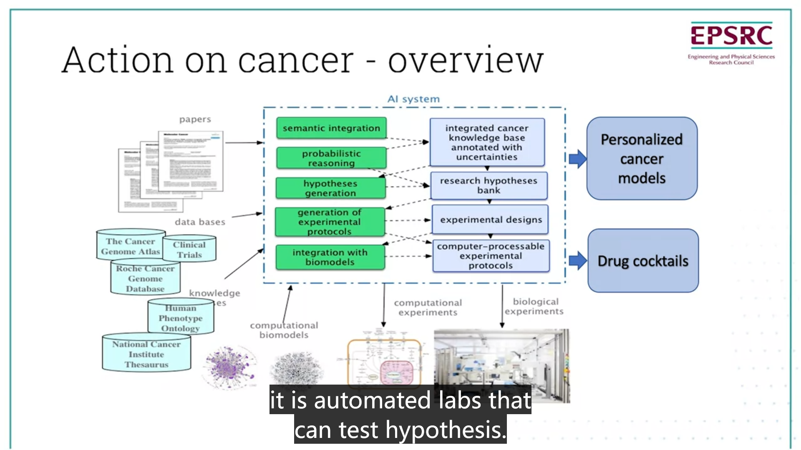
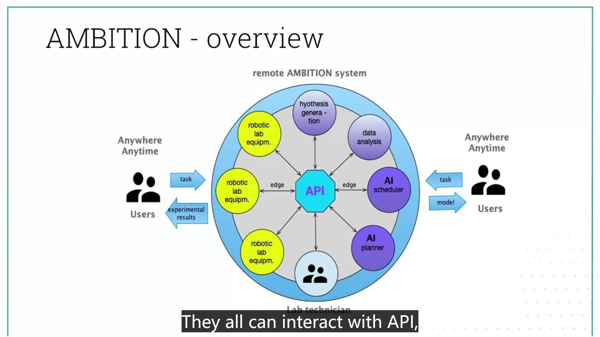

Week 10

# <section-title>Week 10</section-title>
Learning Outcomes
- Critically assess the state of art of the research into automated scientific discovery on the example of the Robot Scientist project
- Develop an argument about the future developments of Robot Scientist
-  Explain the meta-machine learning approach and its advantages

The core agents of the Robot Scientist include
- the knowledge agent
- the hypotheses generation agent
- the planning agent
- the automated robotic lab agent
- the experimental results analysis agent
But it also has some enhancing agents:
Meta-analysis, explanation,communication,monitoring
## Meta-analysis
- Meta-analysis agent collects info about previous runs, results and compare performance of other agents
- what methods the hypothesis generation agent used, which methods work best in what situation
- Eve used machine learning to generate hypotheses 
- Meta-machine learning is learning about machine learning algorithms and what algorithms perform best on what datasets
- **Meta-QSAR** is implemented. A large-scale application of meta-learning to drug design and discovery

### QSAR task
Given a drug target and a set of chemical compounds with associated bioactivities, to learn a predictive mapping from molecular representation to activity

#### No free lunch theorem
There is no universal machine learning algorithm that perfomrs best on all datasets

Meta-learning is to find what learning is better in which scenarios.  We need to understandt the performance characteristics of the main machine learning methods used in QSAR learning

Meta-QSAR learning works because although different dataset have the same overall structure, they differ in:
- numbers of data points
- range and occurrence of features
- the type of chemical / biochemical mechanism that causes the bioactivity

These differences indicate that different machine learning methods are to be used for different kinds of QSAR data

Goal: given QSAR problem, select the best combination of QSAR and molecular representation that maximises a predefined performance measure

#### Meta-features for meta-QSAR learning
- Meta-learning analysis requires a set of meta-features
- characteristics of the datasets considered in the base stuyd and drug target properties are used as meta-features
- meta-features are encoded in an ontology

#### Meta-QSAR performance
- Performances of the best suggested QSAR combination by all Meta-QSAR implementations were compared with a default
- The default was random forest with the fingerprint molecular representation
- Most of the Meta-QSAR implementations improved overall peformance in comparison with the default

## Communication in multi-agent systems

Communication is important in multi-agent systems. Agents can act independently, be competitors or cooperate.

To cooperate on achieving a shared goal:
- Agents need to share knowledge about the goal, the world and each other
- In dynamic environmens, the knowledge has to be constantly updated and shared between agents

Points to consider in Communication:
- what content?
- a protocol for the exchange of information
- mode of communication(text, voice..etc)

This is a hot are of research, for example, the developement

### SciCom
SciCom(Scientific Communication) protocal:
- currently it is minimalistic and needs extensions
- it focuses on the most critical communications: requests for experiments, output of experiment results
- defines syntax and semantics
- it is based on Eve ontology
- passes information about differences from the standard experiment

#### Eve Ontology
Eve ontology provides formal logical description of entities relevant to Eve experiments:
- Typical experiments(optical density) measurement experiments
- possible experimental factors (metabolites, medium, duration)
- Experimental inputs: yeast strains
- Experimental outputs: OD, fluorescence..

Example:

## New Projects

### ACTION(a decision support system for the treatment of cancer)

Aim:
 - develop a prototype AI system for the design of personalised cancer treatments
 - focus on chemotherapies - design of drug cocktails
Long-term aim:
- to perform equally or better than human oncologists in selecting the best cancer treatment

The rational
the treatment of a patient with cancer is complex and individual, the goal of action project focuses on combination of many grugs to find a more effective personalised treatment, harder to develop resistance.

### AMBITION
Aims:
- to harness the power of AI and automated experimentation to provide researchers in the UK and byond with continuous, uninterrupted remote access to AI/robotic augmented biomedical research capabilities.

