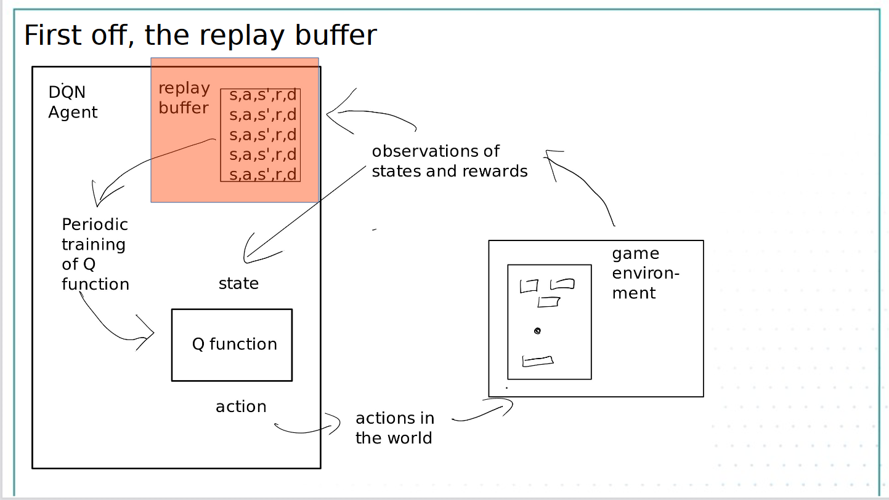
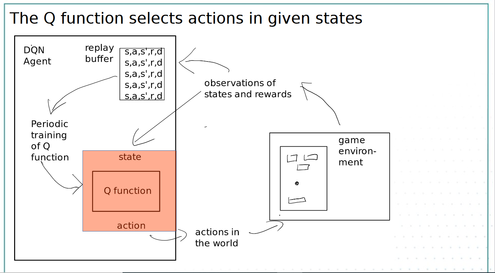

Week 12

# <section-title>Week 12 </section-title>

Most games involve an iterated process of observing and acting. Most games involve some sort of positive or negative result

## Formalisation
**Formalisation of Breakout**

The state is the current view of the game

The actions are move left, move right or stay still

The reward is 1 point each time you hit a brick or game over if you miss the ball

**Formalisatioin: States and actions**

The player observes state s

The player takes action a

the player observes the next state s'

$s, a -> s'$

This is stochastic, so we can add probability P to the transition:

$$P(s' | a,s)$$

Formalisation: Rewards:

There is a reward associated with the $s,a,s'$ construct:

$$s, a, s',r$$

So - taking action a in state $s$ lead to state $s'$ and a reward of $r$

**Markov Decision Process:**
We have ourselves a Markov Decision Process which is a way to formalising a stochastic sequential decision problem

P(s'|s,a) state transition
R(s,a,s') reward function

formalising: expressing something in the mathematics way
stochastics: one state go to another state probablistically
sequential: the process invovles a series of decision making( move left /right for each frame )

The decision is which action are we going to take, what we going to do.

**Action Policy**
The action policy tells us what to do in a given state
Policies are denoted $\pi$. 
So: $\pi(s)\rightarrow a$ means that "The polic for state s is to take action a"

What is an optimal policy?
This is a sequential decision problem, not only one shot. Reward might come in the far future. We need to take into account the reward on the future. 

Therefore, an optimal polcy maximises reward over a sequence of actions. So the action you take now should unlock maximum potential rewards going into the future

**Bellman Equation**
The Belllman equation defines the value of a given action in a given state based on the future reward.

$V*(s,a)$=$max_\pi \sum[r_t+\gamma r_{t+1}+\gamma r_{t+2}+... | s_t=s,a_t=a,\pi]$ 
where
$V*(s,a)$ (value function), the value of action $a$ in state $s$ 

$\gamma < 1$ 
$r_t$ the immediate reward after taking this action
$\gamma r_{t+1}$ the reward in the next time step, $\gamma$ is less than one( $\gamma < 1$ ). This scalar is decreasing. $\gamma^2 r_{t+2}$ the reward in the next after next time step. This scalar is decreasing such that the further the future state is, the weight is lower.

$\pi$ assuming we are using the action policy $\pi$ to select action
$max_\pi$ the highest reward sum, we make the best decision

**The state transition matrix**
The state transition matrix tells us how the state will change over time based on our chosen actions

**action policy**
The **action policy** dictates what the chosen actions will be in each state. It involves choosing the highest value action

The problem is we need to know the complete transition matrix and the associated rewards to make an action policy - not easy for Atari games

**Q-learning**
**Q-learning** try to find the approximation of the value function via observation. It learns the best approximation of the value function
**Q-function** in Q-learning, is the approximation of the value function.
$Q*(s,a)$=$max_\pi \sum[r_t+\gamma r_{t+1}+\gamma r_{t+2}+... | s_t=s,a_t=a,\pi]$ 
There are variious methods to do Q-learning. But most of them don't work for real problems

**DQN**, we learn the Q-function using a deep network

### DQN Agent Architecture
#### Architecture Overview
What is an agent?
An entity that observe and act aotonuously

We need an agent architecture that solves two problems
1) No state transition matrix
2) No action policy

The replay buffer collection information about the world(actions, states, done)

How to generate the replay buffer?
We explore that game and make observations of the form:
$$s,a,s',r,done$$
where 
	$s$ is the state now
	$a$ is the action taken
	$s'$ next state
	$r$ reward
	$done$ true/false is the game finished?

For DQN, this is the 'replay buffer'. Overtime, the agent fills up a large replay buffer.

s1,a1 -> s2, r1, d0

#### Epsilon greedy exploration

At first, we make decisions randomly
Then we use the Q function to make action(greedy action). "**greedy**" means you are using the Q-function to choose an action

**Epsilon greedy**
Epsilon is a number that changing overtime, it indicates how "greedy" you want to be (how likely you use Q-function to make an action)

### The lost function
#### Q in the architecture
The Q-function is a neural network. It takes the a state(screen shot of the current game) as an input, and outputs the action to take (0 move left, 1 move right, 2 stay still).
#### How to train a neural network
We train it on the state transition data. It infer the value of an action in a state taking account of future rewards, instead of inffering the next state.

But we don't have the ground truth. Normally we have a labelled dataset for training and use 20% data for training and 20% for testing. Training involves feeding the inputs in, looking at the error between the desired and the recieved outputs then propagating the error back into the weight of the network. We use the loss function to calculate the error. The loss function indicates the difference between what the network needs to do and what the network actually do. Then we use back propagation to put the value back into the network and adjust the network accordingly

But there is only the replay buffer. We don't know the correct output (answer) here.

#### The DQN loss function
The answer is the loss function which is a bit of a beast.

We keep two version of the network. One is used to estimate the value. Another one is the training one that we update all the time
$\Theta_i$ the weight of the current network
$L_i$ the lost of the current network, what is wrong with the current network
$U()$ take a uniformly random sample
$D$ the replay buffer
$\sum_{s,a,r,s'}$ the training set consist of $s$ the state, $a$ the action,$r$ the reward and $s'$ the next state
$\sum_{s,a,r,s'}U(D)$ we take a uniformly random sample from the replay buffer, and calculate the lost(how good is the network guessing the reward from that)

$\Theta_i^-$ old network
$r$ the actural reward
$\gamma max_{a'}Q(s',a';\Theta_i^-)$ the predicted value on the old network based on the s' and a'. 
$r+\gamma max_{a'}Q(s',a';\Theta_i^-)$ The estimated correct output. The best guess of the value function plus the actural reward of this frame. The best correct answer we have at the moment
$Q(s,a;\Theta_i)$ the output of the current Q function

#### State Secret Sauce: Three frames
In DQN, a state consists of three frames of the game, to give some sense of time to the neural network

#### Image processing: max value
Max -> fixes max sprite problem
In the game, there is a flickering problem in which some pixels appear only on the odd frames while other appear only in even frames. We deal with this problem by combing two frames into one by choosing the pixel with maximum value

#### Image processing: Grey scale
Data reduction. Instead of having RGB color, we only use the luminanace value to reduce the size of the data

#### Image processing: resizing
Resize to 84x84, filiter out the unnecessary data

