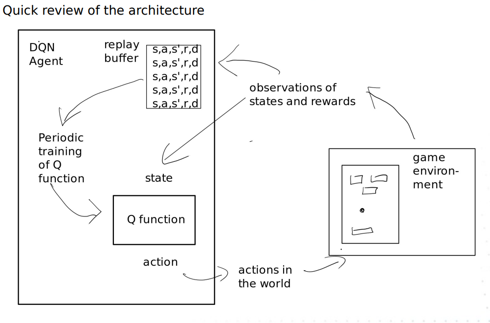
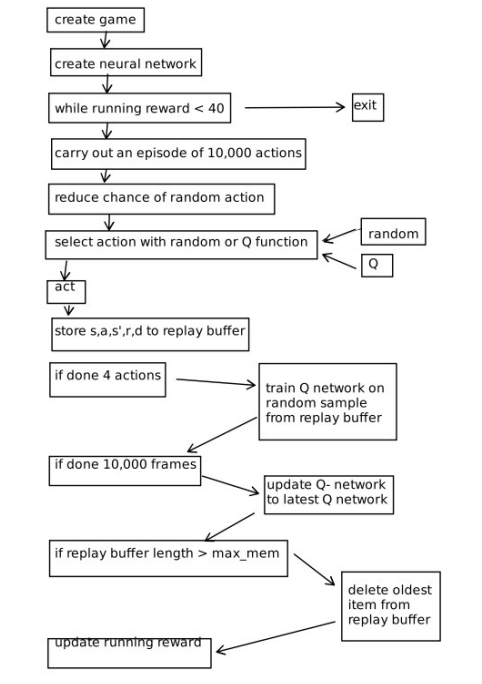
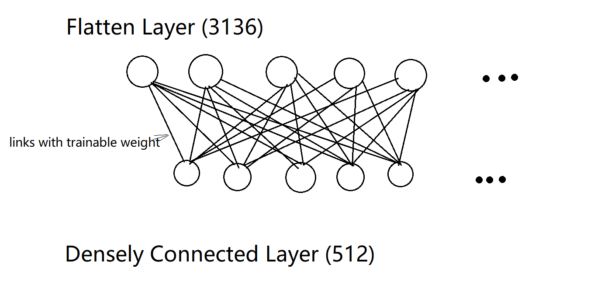

Week 14

# <section-title>Week 14</section-title>

### Overview of the architecture

### Overview of the runtime


Firstly, the game and the neural network are created. While the neural network plays the game getting less than 40 points, we keep training the network. 

To train the network to play the game, 10,000 actions are firstly grouped as an episode. With the chance of picking a random action decreased overtime, we select an action with random or Q function based on the esplion value. Subsequently, the  chosen action is applied to the game and the resulting state $s$, action $a$, next state $s$, reward $r$ and Done $d$ is stored to the replay buffer. When 4 actions are done, we train the Q network on random sample from the replay buffer. When ana episode is finished (10,000 actions done), the Q-network is updated to the latest version. When the replay buffer length is greater than the limit, oldest records are deleted from the replay buffer. 

### The  DQN neural network architecture
The input is the state and the output is the value of all of the actions.

Three covolutional layers apply many filiters. For example, there are 32 filters being applied in a single convolutional layer.  

Falttening layer takes the complicated output of a convolution and turns it into a single layer of nodes

Densly connected layers ahre layers where everything is connected to everything.

#### Input layer
`inputs = layers.Input(shape=(84,84,n,))`
The most recent $n$ frames scaled to 84x84 pixels, using only the luminance values. Instead of RGB colors, we put a sequece of frames of black and white color, which gives a sense of time.


#### Convolutional layers
##### Layer 1
```
layer1 = layers.Conv2D(32, 8, strides=4, activation="relu")(inputs)
```

That's an 8x8 filiter applied to 32 positions in the input with a stride / hop of 4 pixels

Then there are some more:
64,4  strides = 2
64,3, strides = 1

32 is the number of filiters and 20x20 is the size of the output of  each filter. The convolution is caling the frame from 84x84. So that image is being scaled down to 20x20 once it's gone through each of those filters. But we got 32 instances of that image(32 filters), so  32 images coming out from the convolutional layers, but they are all scaled down

##### Layer 2
`layer2 = layers.Conv2D(64,4,strides=2, activation='linear')`
64 6x4 filters are being used to process the image. Stride of 2, moving more carefully. 

64 9x9 images are coming out from layer
##### Layer 3
`layer2 = layers.Conv2D(64,3,strides=1, activation='linear')`
Another 64 3x3 filters are being used to process the image. That scales it down to 64 7x7 images(tiny images)

64 7x7 images are coming out from layer

#### Flattening Layer
`layer4 = layers.Flatten()(layer3)`
7x7x64 nodes are flatten into a single layer with 3136 units

#### Densely connected layer 
##### Densely connected layer  1
` layer5 = layers.Dense(512, activation="relu")(layer4)
`
Each node of the 512 of densely connected layer is connected to each node comming out of the flattening layer ( think of the cartesian product of nodes of the flattening and the densely connected layer). All of the links between nodes have a trainable weight.



##### Densely connected layer  2
`    action = layers.Dense(num_actions, activation="linear")(layer5)
`
There are 4 outputs representing four possible actions in the game 

### Training
#### Training
Verified DQN implementation with Atari breakout 
Then trained against our breakout for this demo

Trained on various platforms

## Acknowlegement
Title: Deep Q-Learning for Atari Breakout
Author: [Jacob Chapman](https://twitter.com/jacoblchapman) and [Mathias Lechner](https://twitter.com/MLech20)

https://github.com/keras-team/keras-io/blob/master/examples/rl/deep_q_network_breakout.py

keras-team/keras-io is licensed under the
Apache License 2.0
