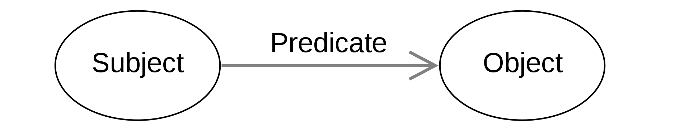

Week 7

# <section-title>Rational Agents</section-title>

An agent is a system that perceives its environment through its sensors and acting upon that environment through actuators

## Rational Agent

An agent that behave rationally

- Performance measure evalutes any given sequence of environment states
- Define the criterion of success
- Prior knowledge of the environment
- For each possible percept sequence, a rational agent should select an action that maximizes its performance measure

## Adversarial Search Problem

Games:
a multi-agent environment
each agent needs to consider the actions of other agents and their affect

## Toy system

Toy robot scientis is designed to assist the drug discovery. It can recommend what chemical compounds are likely to be drugs
Agents:
A **knowledge agent** can access the dataset and update its knowlege model
A **Hypothesis generation agent** agent can generate the hypothesis from the background knowledge about drug design and available chemical data
A **planner agent** designs experiments to test the formulated hypothesis
A **lab agent** follows the protocol, do experiments and records ovservations and experimental results.
A **interpretation agent** recieves the experimental data and decide if the hypothesis were confirmed or not

These are the baisc agents for the toy system. The following agents can enhance the toy system.
A **meta-analysis agent** collects information about runs, results and compares performance of other agents
a **collaboration agen**t supports a team of robot scientists or a team of human and robot scientists
A **monitoring agent** monitors and records everything what is happening
And **external services agent** is an interace for external users
A **model agent** works with executable computational models and runs simulations
An **explanation agent** produces explanations about the working of the system andits conclusions

## Knowledge representation

knowledge has to be represented in a machine processable way
The knowledge-based agentsneeds to access process andupdate its knowledgebase

### Logics
To enable logical inference over knowledge, that knowledge has to be encoded in logic
logics: description logic, propositional logic, first order logic(FOL ...
Different logics feature a different balance between expressive power and reasoning complexity

Knowledge representation langauge: RDF and prolog
Entities and Relationship

#### Languages

RDF:

provides a model for describing resources
defines a resource as any object that is uniquely identifiable by an URI
Resources have properties that link resources to other resources
Resources can be linked to some values - data properties

The logic behind RDF is description logic
RDFS Turtle format is a syntax that is easier to read for humans
rdfs: Class is used to classify resources

rdfs: property is used to add relations to classes

### Toy Knowledge Base

#### Domain of drug discovery

The initial stages:
A library screening
A library is a collection of chemical compounds. Screening is running experimenets with chemical compounds in a lab to find the hits. Hits are the compounds that have shown biological activity. Then we do experiments to confirm the hits that can work on different concentration level. Confirmed hits are called leads. Leads have chance to become an approved drug.

The toy robot scientist is to identify leads.

#### How to represent a chemical compound

A chemical compound can be represented in many ways: image, formula. We would use table for toy scientist.

|  Compound   |  Molecular Weight   |  Hydrophobicity   |  Hydrogen donor   |  Hydrogen acceptor   |  Heavy atom   |  Aromatic Ring   |
| --- | --- | --- | --- | --- | --- | --- |
| Aspirin   |  180.16   |  1.31   |  1   |   3  |  13   |   1  |

We represent the toy domain(the table) using logic

Ways to encode the toy domain
- Encode in RDF and export to python- RDF will ensure a good structure
- Use Protege to encode in RDF, and then export to python- reasoners can check
logical consistency and infer new facts.
- Encode it in First Order Logic in prolog.
